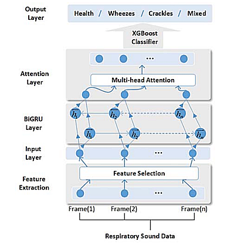
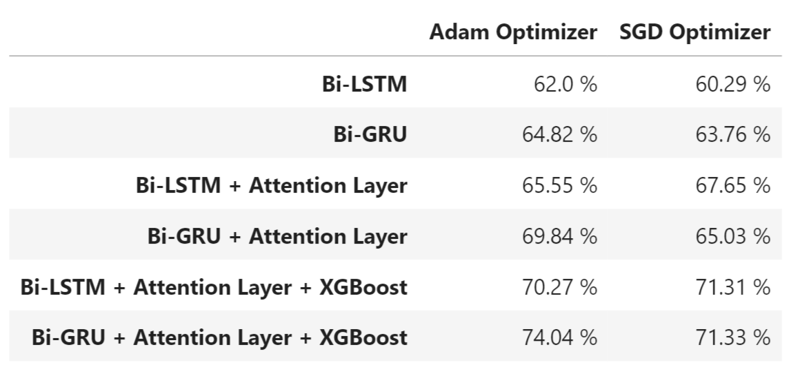

# **Respiratory Sound Classification**
In this project, we construct a hybrid framework for the
classification task of respiratory sounds. The framework 
initially uses a wide range techniques to extract time-domain
and spectral features. Then it trains BiGRU with Attention
mechanism to extract more advanced features of respiratory
sounds for XGBoost to classify.

## **Dataset**
We use a dataset of respiratory sounds from the International Conference on Biomedicine and Health Informatics (ICBHI 2017) Challenge.
The dataset has 539 audio files, 539 text files and 539 .hea files corresponding to 539 patients.
* __.wav__ audio files contain respiratory audio samples
* __.txt__ files contain data indicating the presence of crackles and wheezes at different intervals of time in audio sample. ( columns = [start time, end time, crackles, wheezes] )
* __.hea__ files have information about the internal organ part from where the sound is recorded.

> Access the Dataset from here : [download dataset](https://bhichallenge.med.auth.gr/sites/default/files/ICBHI_public_dataset.zip)

## **Feature Extraction**
We extract two sets of features from each sample of respiratory sounds :
* Time-Domain Features :
    1. Short-term Average Zero-crossing Rate
    2. RMS Energry
* Spectral Features :
    1. Spectral Centroid
    2. Spectral Slope
    3. Spectral Contrast
    4. Chromaticity
    5. MFCC

After feature extraction, the dataset has shape : (539, 862, 47).\
Here 539 is number of datapoints (number of patients), 862 is the frames we extract from each audio sample and 47 are the number of extracted features each audio samples have.

## **Training Models**
We trained different RNN architectures to get the best results. Following are two of them :

* <h3>Initial Model :</h3>

* <h3>Final Model :</h3>

## **Results**

